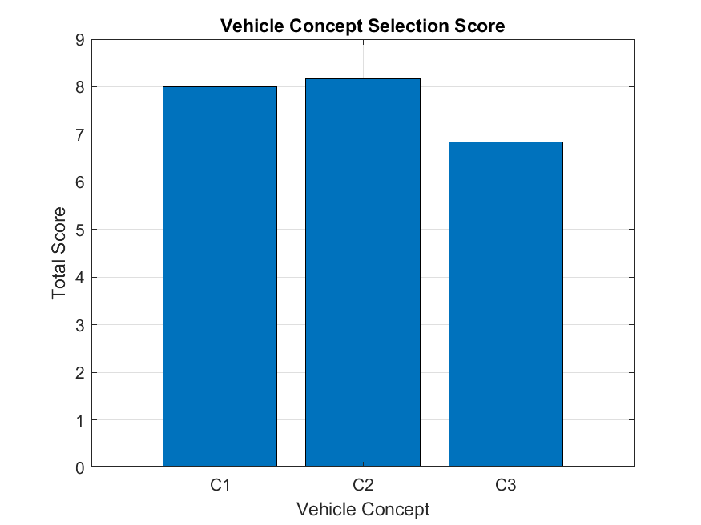
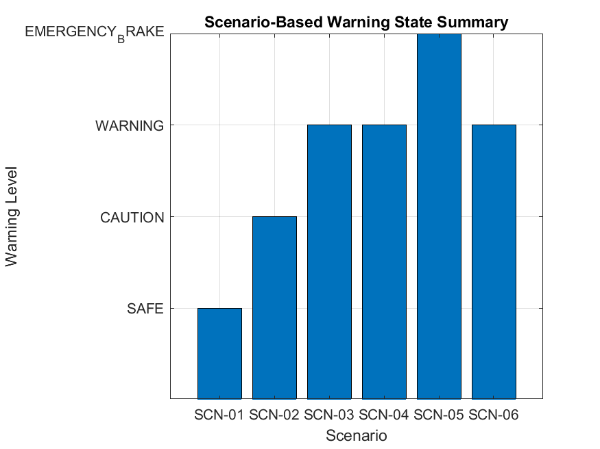
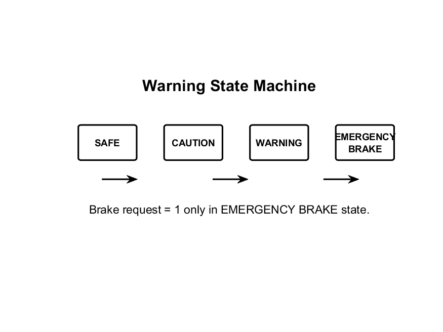
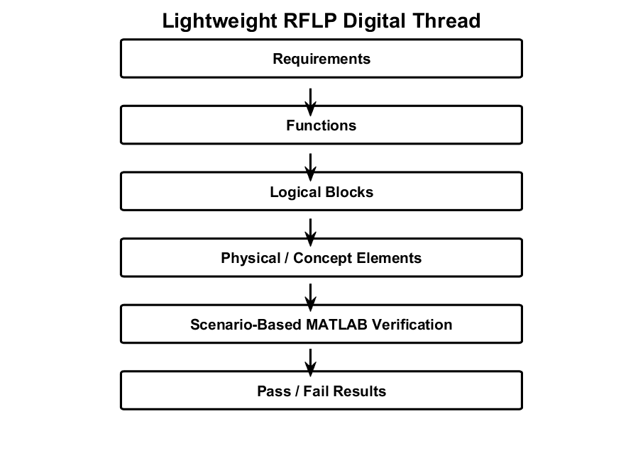

# UrbanEV-BBW-RFLP-Verification

## Lightweight MBSE/RFLP Concept Design and MATLAB-Based Verification of Concept-Level Brake-by-Wire Emergency Brake-Request Logic for a Low-Speed Urban EV

This project develops a university-level lightweight MBSE/RFLP workflow for a low-speed urban EV.

It compares three vehicle concepts using MATLAB-based range estimation, braking-distance analysis, and normalized decision scoring. The selected concept is then extended into concept-level brake-by-wire emergency brake-request logic, including requirements, RFLP decomposition, actuator concept selection, simplified scenario inputs, and MATLAB-based verification.

---

## Project Positioning

This project follows a lightweight MBSE/RFLP workflow suitable for university-level concept design and MATLAB-based scenario verification.

It does not claim to be:

- a complete industrial MBSE implementation
- a production-ready brake-by-wire system
- a certified safety-critical braking system
- a full autonomous emergency braking system

---

## What This Project Does

- Compares three low-speed urban EV concepts
- Estimates range using a simplified physics-based MATLAB model
- Calculates stopping distance under dry and wet road conditions
- Calculates TTC using target distance and relative speed
- Classifies warning states:
  - SAFE
  - CAUTION
  - WARNING
  - EMERGENCY_BRAKE
- Generates `brake_request = 1` only in the `EMERGENCY_BRAKE` state
- Selects a concept-level actuator candidate
- Links requirements to functions, logical blocks, physical/concept elements, and verification scenarios
- Produces MATLAB-based verification outputs

---

## What This Project Does Not Claim

This project does not claim:

- production-ready brake-by-wire design
- complete industrial MBSE implementation
- ISO 26262 compliance
- SOTIF compliance
- real perception or sensor fusion
- ROS2 integration in the main version
- hardware-in-the-loop or software-in-the-loop validation
- real actuator dynamics
- full autonomous emergency braking
- production AEB functionality

---

## Repository Structure

```text
UrbanEV-BBW-RFLP-Verification/
|
|-- README.md
|
|-- docs/
|   |-- index.md
|   |-- 01_project_overview.md
|   |-- 02_black_box_analysis.md
|   |-- 03_requirements_quality_review.md
|   |-- 04_concept_generation.md
|   |-- 05_concept_screening.md
|   |-- 06_verification_plan.md
|   |-- 07_traceability_links.md
|   |-- 08_assumptions_and_limitations.md
|   |-- 09_scenario_catalog.md
|   |-- 10_engineering_decision_log.md
|   |-- 11_simple_risk_register.md
|   |-- 12_verification_coverage.md
|   |-- 13_future_work_and_internship_extension.md
|   |-- 14_demo_guide.md
|   |-- 15_operational_design_domain.md
|   |-- 16_scenario_taxonomy.md
|   |-- 17_stpa_lite_safety_analysis.md
|   |-- 18_robustness_and_sensitivity_analysis.md
|   |-- 19_verification_coverage_metrics.md
|   |-- 20_parameterized_scenario_testing.md
|
|-- data/
|   |-- vehicle_concepts.csv
|   |-- requirements.csv
|   |-- scenarios.csv
|   |-- actuator_candidates.csv
|   |-- stakeholder_needs.csv
|   |-- interfaces.csv
|   |-- concept_screening.csv
|   |-- functions.csv
|   |-- logical_blocks.csv
|   |-- physical_components.csv
|   |-- function_logical_allocation.csv
|   |-- logical_physical_allocation.csv
|   |-- verification_plan.csv
|   |-- traceability_links.csv
|   |-- odd_definition.csv
|   |-- parameterized_scenarios.csv
|   |-- stpa_hazards.csv
|   |-- unsafe_control_actions.csv
|   |-- safety_constraints.csv
|
|-- matlab/
|   |-- run_all.m
|   |-- range_estimation_model.m
|   |-- braking_distance_model.m
|   |-- ttc_model.m
|   |-- warning_logic_model.m
|   |-- bbw_emergency_braking_controller.m
|   |-- concept_selection_model.m
|   |-- actuator_concept_selection.m
|   |-- generate_parameterized_scenarios.m
|   |-- scenario_batch_verification.m
|   |-- robustness_monte_carlo_analysis.m
|   |-- coverage_analysis.m
|
|-- results/
|   |-- concept_selection_results.csv
|   |-- scenario_verification_results.csv
|   |-- actuator_selection_results.csv
|   |-- traceability_matrix.csv
|   |-- verification_summary.md
|   |-- parameterized_scenario_results.csv
|   |-- robustness_results.csv
|   |-- robustness_sample_points.csv
|   |-- requirement_coverage_results.csv
|   |-- odd_coverage_results.csv
|
|-- figures/
|   |-- vehicle_concept_comparison.png
|   |-- scenario_verification_summary.png
|   |-- warning_state_machine.png
|   |-- rflp_digital_thread.png
|   |-- scenario_parameter_space.png
|   |-- parameterized_verification_summary.png
|   |-- parameterized_warning_state_distribution.png
|   |-- robustness_pass_rate.png
|   |-- threshold_sensitivity_map.png
|   |-- verification_coverage_chart.png
|   |-- odd_coverage_chart.png
```

---

## Methodology

```text
Vehicle Concept Definition
        ↓
MATLAB-Based Range and Braking Analysis
        ↓
Concept Selection Using Normalized Scoring
        ↓
Lightweight RFLP Decomposition
        ↓
Concept-Level Emergency Brake-Request Logic
        ↓
Scenario-Based MATLAB Verification
        ↓
Requirements-to-Verification Traceability
```

---

## Vehicle Concept Design

Three low-speed urban EV concepts are compared:

| Concept | Description |
|---|---|
| C1 | Campus-focused lightweight EV |
| C2 | Balanced low-speed urban EV |
| C3 | Extended urban EV |

The selected concept is:

```text
C2 — Balanced low-speed urban EV
```

C2 is selected because it provides the best balance between estimated range, braking performance, motor adequacy, mass, and feasibility.

---

## Concept-Level Brake-Request Logic

The emergency brake-request logic uses:

- ego speed
- target distance
- relative speed
- road friction coefficient
- actuator/controller delay

The model calculates:

- stopping distance
- TTC
- warning state
- brake request

Brake request logic:

| Warning State | Brake Request |
|---|---:|
| SAFE | 0 |
| CAUTION | 0 |
| WARNING | 0 |
| EMERGENCY_BRAKE | 1 |

`WARNING` is treated as a driver/HMI warning state, not as an automatic braking command.

---

## Scenario-Based Verification

Six simplified scenarios are used:

| Scenario | Description | Expected State |
|---|---|---|
| SCN-01 | Normal following | SAFE |
| SCN-02 | Close but not critical target | CAUTION |
| SCN-03 | High closing risk | WARNING |
| SCN-04 | Wet-road warning case | WARNING |
| SCN-05 | Sudden stationary obstacle | EMERGENCY_BRAKE |
| SCN-06 | Delay-sensitive wet case | WARNING |

Generated verification results are stored in:

```text
results/scenario_verification_results.csv
results/verification_summary.md
```

---

## Key Figures

### Vehicle Concept Selection



### Scenario-Based Warning State Summary



### Warning State Machine



### Lightweight RFLP Digital Thread



---

## Main Results

Current generated results:

```text
Selected concept: C2
Selected actuator: A2
All scenario verification checks: Pass
Brake request is generated only in SCN-05
```

Selected actuator:

```text
A2 — Electro-hydraulic brake actuator
```

The actuator is selected only as a concept-level physical candidate, not as a detailed production actuator design.

---

## How to Run

Open MATLAB, navigate to the repository root folder, and run:

```matlab
run("matlab/run_all.m")
```

The script generates:

```text
results/concept_selection_results.csv
results/scenario_verification_results.csv
results/actuator_selection_results.csv
results/traceability_matrix.csv
results/verification_summary.md

figures/vehicle_concept_comparison.png
figures/scenario_verification_summary.png
figures/warning_state_machine.png
figures/rflp_digital_thread.png
```

---

## Relation to Previous ADAS Projects

This project extends my previous ADAS portfolio from perception-level risk estimation toward downstream vehicle-level emergency braking verification.

My previous projects focused on:

- monocular object detection
- ROI-based relevance filtering
- proxy risk scoring
- ROS2 modularization
- forward-warning generation

In contrast, this project assumes simplified scenario-level risk inputs and focuses on:

- concept-level brake-by-wire emergency brake-request logic
- lightweight MBSE/RFLP decomposition
- actuator concept selection
- MATLAB-based requirement verification

Conceptual chain:

```text
Perception → Risk Estimation → Forward Warning → Emergency Brake Request → Concept-Level Brake-by-Wire Logic → Scenario-Based Verification
```

---

## Limitations

This project is intentionally limited.

It does not include:

- real brake pressure control
- hydraulic dynamics
- ECU implementation
- redundancy handling
- failure handling
- ISO 26262 analysis
- SOTIF analysis
- real sensor fusion
- real perception data
- production AEB functionality

The stopping-distance and TTC models are simplified and are used only for concept-level verification.

---

## Future Work

The current project is complete at a university-level concept-design and MATLAB-based verification scope.

Future work can further extend the project without changing the current scope-safe positioning.

Possible extensions include:

- Transfer the lightweight RFLP structure into MATLAB System Composer for formal architecture views, ports, interfaces, allocations, and requirement links.
- Implement the warning-state and brake-request logic as a Simulink block-level model.
- Add Simulink Test cases for formalized scenario assessment and requirement-linked test results.
- Expand the parameterized scenario space with more near-threshold, low-speed campus, wet-road, and actuator-delay cases.
- Add more detailed actuator-response modelling while still avoiding production brake-by-wire claims.
- Add simplified fault or invalid-input scenarios, such as missing distance input, unrealistic friction value, or delayed input update.
- Add a lightweight report-generation script that automatically summarizes concept selection, scenario verification, robustness results, and coverage metrics.
- Optionally connect the downstream brake-request logic to previous ADAS perception projects in a separate future branch.

These future extensions should remain clearly separated from production AEB, ISO 26262, ISO 21448/SOTIF, HIL/SIL, real sensor fusion, and industrial brake-by-wire validation claims.

---

## Additional Documentation Added for Course Alignment

To better align this project with the Concept Design of New Vehicles course workflow, the project includes additional lightweight MBSE/RFLP and concept-design documentation.

These documents strengthen the project without turning it into a full industrial MBSE, ISO 26262, SOTIF, or production brake-by-wire implementation.

### Added Documentation Files

| File | Purpose |
|---|---|
| `docs/02_black_box_analysis.md` | Defines the system boundary, mission, lifecycle, external actors, interfaces, operating modes, and services. |
| `docs/03_requirements_quality_review.md` | Reviews the requirements using simple requirements-engineering quality criteria. |
| `docs/04_concept_generation.md` | Explains how the three low-speed urban EV concepts were generated before selection. |
| `docs/05_concept_screening.md` | Adds a qualitative Pugh-style concept-screening step before MATLAB-based scoring. |
| `docs/06_verification_plan.md` | Defines requirement-level verification items, assessment types, pass rules, and evidence files. |
| `docs/07_traceability_links.md` | Explains the lightweight traceability-link structure from needs to verification. |
| `docs/08_assumptions_and_limitations.md` | Defines the project assumptions and limitations to prevent overclaiming. |
| `docs/09_scenario_catalog.md` | Documents the dry/wet braking scenarios used for MATLAB verification. |
| `docs/10_engineering_decision_log.md` | Records the main engineering decisions and their rationale. |
| `docs/11_simple_risk_register.md` | Identifies simple project risks and mitigation actions. |
| `docs/12_verification_coverage.md` | Summarizes requirement coverage and verification evidence. |
| `docs/13_future_work_and_internship_extension.md` | Describes realistic future extensions suitable for internship growth. |
| `docs/14_demo_guide.md` | Explains how to run the project and inspect the results. |

### Added Data Files

| File | Purpose |
|---|---|
| `data/stakeholder_needs.csv` | Links stakeholder needs to derived requirements. |
| `data/interfaces.csv` | Defines scenario inputs, internal signals, outputs, units, and source/destination elements. |
| `data/concept_screening.csv` | Provides qualitative concept screening before final scoring. |
| `data/functions.csv` | Defines the functional architecture elements. |
| `data/logical_blocks.csv` | Defines the logical architecture elements. |
| `data/physical_components.csv` | Defines concept-level physical components and implementation elements. |
| `data/function_logical_allocation.csv` | Maps functions to logical blocks. |
| `data/logical_physical_allocation.csv` | Maps logical blocks to physical/concept components. |
| `data/verification_plan.csv` | Defines verification items, pass rules, and expected evidence. |
| `data/traceability_links.csv` | Defines need-requirement-function-logical-physical-verification links. |

### Updated Project Logic

The extended project now follows this clearer academic workflow:

```text
Needs
→ Black Box Analysis
→ Requirements Definition and Quality Review
→ Concept Generation
→ Concept Screening
→ MATLAB-Based Concept Scoring
→ Lightweight RFLP Architecture
→ Scenario-Based Verification
→ Traceability Links
→ Verification Coverage
```

### Scope-Safe Positioning

This project remains a university-level concept design and MATLAB verification project.

It does not claim:

- production-ready brake-by-wire design;
- full autonomous driving;
- real camera/radar perception;
- sensor fusion;
- ISO 26262 compliance;
- SOTIF compliance;
- HIL/SIL validation;
- full industrial MBSE implementation.

The added documentation improves clarity, traceability, and reviewability while keeping the project realistic and executable.


## Advanced Scope-Safe Extensions

To strengthen the project while keeping it realistic and university-level, several advanced but scope-safe extensions were added.

These extensions improve the project toward modern ADAS-oriented concept verification, safety reasoning, and MATLAB-based robustness analysis.

The project still does not claim production brake-by-wire design, full AEB functionality, ISO 26262 compliance, ISO 21448/SOTIF compliance, HIL/SIL validation, real sensor fusion, or industrial MBSE completeness.

### Added Advanced Extensions

| Extension | Purpose | Main Files |
|---|---|---|
| ODD Definition | Defines the valid operating envelope for the low-speed urban EV concept. | `docs/15_operational_design_domain.md`, `data/odd_definition.csv` |
| Scenario Taxonomy | Defines an ODD-constrained parameterized scenario space. | `docs/16_scenario_taxonomy.md`, `matlab/generate_parameterized_scenarios.m` |
| STPA-Lite Safety Analysis | Adds lightweight safety reasoning around unsafe brake-request control actions. | `docs/17_stpa_lite_safety_analysis.md`, `data/stpa_hazards.csv`, `data/unsafe_control_actions.csv`, `data/safety_constraints.csv` |
| Parameterized Scenario Testing | Batch-verifies a generated scenario set across speed, road, delay, and risk-family variations. | `docs/20_parameterized_scenario_testing.md`, `matlab/scenario_batch_verification.m` |
| Robustness / Monte Carlo Analysis | Tests warning-state stability under simplified input uncertainty. | `docs/18_robustness_and_sensitivity_analysis.md`, `matlab/robustness_monte_carlo_analysis.m` |
| Requirement and ODD Coverage Metrics | Calculates simple coverage metrics for requirements and ODD entries. | `docs/19_verification_coverage_metrics.md`, `matlab/coverage_analysis.m` |

### Advanced Workflow

```text
Stakeholder Needs
→ Black Box Analysis
→ ODD Definition
→ Requirements Definition and Quality Review
→ Concept Generation
→ Concept Screening
→ MATLAB-Based Concept Scoring
→ Lightweight RFLP Architecture
→ STPA-Lite Safety Analysis
→ Scenario Taxonomy
→ Parameterized Scenario Generation
→ Scenario-Based MATLAB Verification
→ Robustness / Monte Carlo Analysis
→ Traceability Links
→ Requirement and ODD Coverage Metrics
→ Verification Summary
```

### Advanced MATLAB Scripts

| Script | Purpose |
|---|---|
| `matlab/generate_parameterized_scenarios.m` | Generates an ODD-constrained parameterized scenario set using the default scenario-generation settings. |
| `matlab/scenario_batch_verification.m` | Runs batch verification over the generated parameterized scenarios. |
| `matlab/robustness_monte_carlo_analysis.m` | Runs Monte Carlo robustness analysis under simplified input uncertainty. |
| `matlab/coverage_analysis.m` | Calculates requirement coverage and ODD coverage metrics. |

### Advanced Output Files

| Output | Purpose |
|---|---|
| `data/parameterized_scenarios.csv` | Stores generated parameterized scenarios. |
| `results/parameterized_scenario_results.csv` | Stores batch verification results for generated scenarios. |
| `results/robustness_results.csv` | Summarizes Monte Carlo robustness metrics. |
| `results/robustness_sample_points.csv` | Stores Monte Carlo sample-level outputs. |
| `results/requirement_coverage_results.csv` | Stores requirement coverage status. |
| `results/odd_coverage_results.csv` | Stores ODD coverage status. |
| `figures/scenario_parameter_space.png` | Shows the generated scenario space. |
| `figures/parameterized_verification_summary.png` | Shows pass/fail summary for generated scenarios. |
| `figures/parameterized_warning_state_distribution.png` | Shows calculated warning-state distribution. |
| `figures/robustness_pass_rate.png` | Shows expected-state robustness rate. |
| `figures/threshold_sensitivity_map.png` | Shows sensitivity of warning state to speed and distance variation. |
| `figures/verification_coverage_chart.png` | Shows requirement coverage summary. |
| `figures/odd_coverage_chart.png` | Shows ODD coverage summary. |

### Scope-Safe Interpretation

These extensions are inspired by ODD definition, scenario-based verification, and safety-engineering practices.

However, they remain lightweight and academic.

They are not formal implementations of ASAM OpenODD, ASAM OpenSCENARIO, ISO 34502, ISO 26262, ISO 21448/SOTIF, production AEB validation, real brake-by-wire validation, real sensor fusion, HIL testing, or SIL testing.

The purpose is to make the project more traceable, testable, and internship-oriented while keeping it realistic and executable.


## Documentation Reading Guide

The documentation was expanded step by step to support the course-aligned concept-design workflow.

To avoid confusion and provide a clear reading order, a documentation index is provided here:

- `docs/index.md`

This index explains the recommended order for reviewing the project documents, including Black Box Analysis, ODD definition, concept generation, scenario taxonomy, STPA-Lite safety analysis, robustness analysis, traceability, coverage metrics, and demo guidance.

The index is only an organizational guide and does not introduce additional industrial claims.
