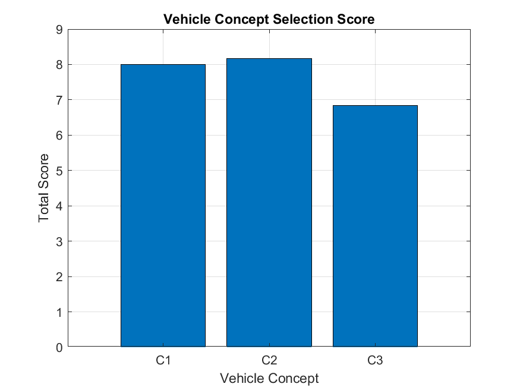
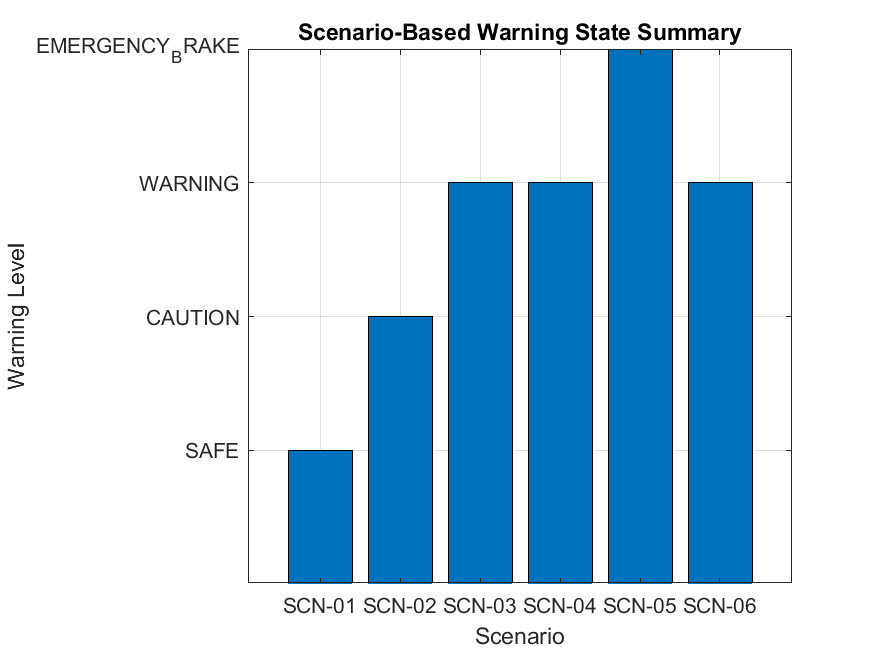
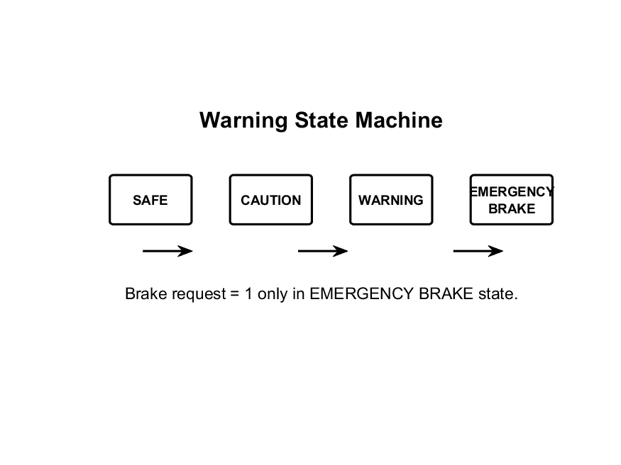
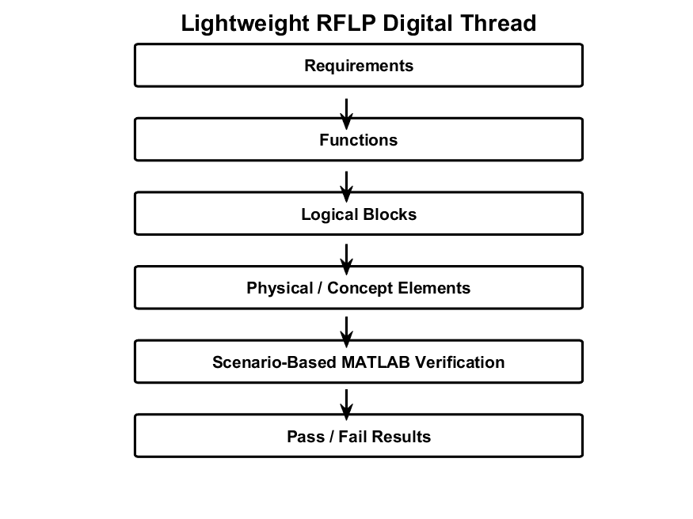

# UrbanEV-BBW-RFLP-Verification

## Final Project Navigation

This repository is organized as a lightweight MBSE/RFLP and MATLAB/Simulink verification project for concept-level emergency brake-request logic in a low-speed urban EV.

### Recommended Evaluation Path

| Step | What to Review | Main File / Evidence |
|---|---|---|
| 1 | Project overview and scope | `README.md` |
| 2 | Requirements and scenarios | `data/requirements.csv`, `data/scenarios.csv` |
| 3 | MATLAB verification workflow | `matlab/run_all.m` |
| 4 | Presentation-ready Simulink model | `models/urban_ev_bbw_warning_logic_final_presentation.slx` |
| 5 | Simulink testing model | `models/urban_ev_bbw_warning_logic_test_validation.slx` |
| 6 | Scenario-based test results | `results/simulink_test_validation_results.csv` |
| 7 | Requirement-to-test traceability | `results/simulink_requirement_test_traceability.csv` |
| 8 | Official Simulink Test Manager suite | `UrbanEV_BBW_All_Scenarios_Test_Manager_v2.mldatx` |
| 9 | Course workflow alignment | `docs/22_alignment_with_course_mandatory_contents.md` |
| 10 | Final presentation support | `docs/25_final_presentation_slide_plan.md`, `docs/26_final_presentation_speaker_script.md` |

### Final Claim

This project demonstrates a concept-level MBSE/RFLP and MATLAB/Simulink verification workflow. It does not claim production brake-by-wire validation, certified safety compliance, real sensor fusion, HIL/SIL validation, or ISO 26262 compliance.


## Lightweight MBSE/RFLP Concept Design and MATLAB-Based Verification of Concept-Level Brake-by-Wire Emergency Brake-Request Logic for a Low-Speed Urban EV

This project develops a university-level lightweight MBSE/RFLP workflow for a low-speed urban EV.

It compares three vehicle concepts using MATLAB-based range estimation, braking-distance analysis, and normalized decision scoring. The selected concept is then extended into concept-level brake-by-wire emergency brake-request logic, including requirements, RFLP decomposition, actuator concept selection, simplified scenario inputs, and MATLAB-based verification.

---

## Project Positioning

This project follows a lightweight MBSE/RFLP workflow suitable for university-level concept design and MATLAB-based scenario verification.

It does not claim to be:

- a complete industrial MBSE implementation
- a concept-level demonstration brake-by-wire system
- a formally approved safety-critical braking system
- a full autonomous emergency braking system

---

## What This Project Does

- Compares three low-speed urban EV concepts
- Estimates range using a simplified physics-based MATLAB model
- Calculates stopping distance under dry and wet road conditions
- Calculates TTC using target distance and relative speed
- Classifies warning states:
  - SAFE
  - CAUTION
  - WARNING
  - EMERGENCY_BRAKE
- Generates `brake_request = 1` only in the `EMERGENCY_BRAKE` state
- Selects a concept-level actuator candidate
- Links requirements to functions, logical blocks, physical/concept elements, and verification scenarios
- Produces MATLAB-based verification outputs

---

## What This Project Does Not Claim

This project does not claim:

- concept-level demonstration brake-by-wire design
- complete industrial MBSE implementation
- ISO 26262-level industrial safety assessment
- SOTIF-level industrial safety assessment
- real perception or sensor fusion
- ROS2 integration in the main version
- hardware-in-the-loop or software-in-the-loop validation
- real actuator dynamics
- full autonomous emergency braking
- production AEB functionality

---

## Repository Structure

```text
UrbanEV-BBW-RFLP-Verification/
|
|-- README.md
|
|-- docs/
|   |-- index.md
|   |-- 01_project_overview.md
|   |-- 02_black_box_analysis.md
|   |-- 03_requirements_quality_review.md
|   |-- 04_concept_generation.md
|   |-- 05_concept_screening.md
|   |-- 06_verification_plan.md
|   |-- 07_traceability_links.md
|   |-- 08_assumptions_and_limitations.md
|   |-- 09_scenario_catalog.md
|   |-- 10_engineering_decision_log.md
|   |-- 11_simple_risk_register.md
|   |-- 12_verification_coverage.md
|   |-- 13_future_work_and_internship_extension.md
|   |-- 14_demo_guide.md
|   |-- 15_operational_design_domain.md
|   |-- 16_scenario_taxonomy.md
|   |-- 17_stpa_lite_safety_analysis.md
|   |-- 18_robustness_and_sensitivity_analysis.md
|   |-- 19_verification_coverage_metrics.md
|   |-- 20_parameterized_scenario_testing.md
|
|-- data/
|   |-- vehicle_concepts.csv
|   |-- requirements.csv
|   |-- scenarios.csv
|   |-- actuator_candidates.csv
|   |-- stakeholder_needs.csv
|   |-- interfaces.csv
|   |-- concept_screening.csv
|   |-- functions.csv
|   |-- logical_blocks.csv
|   |-- physical_components.csv
|   |-- function_logical_allocation.csv
|   |-- logical_physical_allocation.csv
|   |-- verification_plan.csv
|   |-- traceability_links.csv
|   |-- odd_definition.csv
|   |-- parameterized_scenarios.csv
|   |-- stpa_hazards.csv
|   |-- unsafe_control_actions.csv
|   |-- safety_constraints.csv
|
|-- matlab/
|   |-- run_all.m
|   |-- range_estimation_model.m
|   |-- braking_distance_model.m
|   |-- ttc_model.m
|   |-- warning_logic_model.m
|   |-- bbw_emergency_braking_controller.m
|   |-- concept_selection_model.m
|   |-- actuator_concept_selection.m
|   |-- generate_parameterized_scenarios.m
|   |-- scenario_batch_verification.m
|   |-- robustness_monte_carlo_analysis.m
|   |-- coverage_analysis.m
|
|-- results/
|   |-- concept_selection_results.csv
|   |-- scenario_verification_results.csv
|   |-- actuator_selection_results.csv
|   |-- traceability_matrix.csv
|   |-- verification_summary.md
|   |-- parameterized_scenario_results.csv
|   |-- robustness_results.csv
|   |-- robustness_sample_points.csv
|   |-- requirement_coverage_results.csv
|   |-- odd_coverage_results.csv
|
|-- figures/
|   |-- vehicle_concept_comparison.png
|   |-- scenario_verification_summary.png
|   |-- warning_state_machine.png
|   |-- rflp_digital_thread.png
|   |-- scenario_parameter_space.png
|   |-- parameterized_verification_summary.png
|   |-- parameterized_warning_state_distribution.png
|   |-- robustness_pass_rate.png
|   |-- threshold_sensitivity_map.png
|   |-- verification_coverage_chart.png
|   |-- odd_coverage_chart.png
```

---

## Methodology

```text
Vehicle Concept Definition
        ↓
MATLAB-Based Range and Braking Analysis
        ↓
Concept Selection Using Normalized Scoring
        ↓
Lightweight RFLP Decomposition
        ↓
Concept-Level Emergency Brake-Request Logic
        ↓
Scenario-Based MATLAB Verification
        ↓
Requirements-to-Verification Traceability
```

---

## Vehicle Concept Design

Three low-speed urban EV concepts are compared:

| Concept | Description |
|---|---|
| C1 | Campus-focused lightweight EV |
| C2 | Balanced low-speed urban EV |
| C3 | Extended urban EV |

The selected concept is:

```text
C2 — Balanced low-speed urban EV
```

C2 is selected because it provides the best balance between estimated range, braking performance, motor adequacy, mass, and feasibility.

---

## Concept-Level Brake-Request Logic

The emergency brake-request logic uses:

- ego speed
- target distance
- relative speed
- road friction coefficient
- actuator/controller delay

The model calculates:

- stopping distance
- TTC
- warning state
- brake request

Brake request logic:

| Warning State | Brake Request |
|---|---:|
| SAFE | 0 |
| CAUTION | 0 |
| WARNING | 0 |
| EMERGENCY_BRAKE | 1 |

`WARNING` is treated as a driver/HMI warning state, not as an automatic braking command.

---

## Scenario-Based Verification

Six simplified scenarios are used:

| Scenario | Description | Expected State |
|---|---|---|
| SCN-01 | Normal following | SAFE |
| SCN-02 | Close but not critical target | CAUTION |
| SCN-03 | High closing risk | WARNING |
| SCN-04 | Wet-road warning case | WARNING |
| SCN-05 | Sudden stationary obstacle | EMERGENCY_BRAKE |
| SCN-06 | Delay-sensitive wet case | WARNING |

Generated verification results are stored in:

```text
results/scenario_verification_results.csv
results/verification_summary.md
```

---

## Key Figures

### Vehicle Concept Selection



### Scenario-Based Warning State Summary



### Warning State Machine



### Lightweight RFLP Digital Thread



---

## Main Results

Current generated results:

```text
Selected concept: C2
Selected actuator: A1
All scenario verification checks: Pass
Brake request is generated only in SCN-05
```

Selected actuator:

```text
A1 — Electric linear brake actuator
```

The actuator is selected only as a concept-level physical candidate, not as a detailed production actuator design.

---

## How to Run

Open MATLAB, navigate to the repository root folder, and run:

```matlab
run("matlab/run_all.m")
```

The script generates:

```text
results/concept_selection_results.csv
results/scenario_verification_results.csv
results/actuator_selection_results.csv
results/traceability_matrix.csv
results/verification_summary.md

figures/vehicle_concept_comparison.png
figures/scenario_verification_summary.png
figures/warning_state_machine.png
figures/rflp_digital_thread.png
```

---

## Relation to Previous ADAS Projects

This project extends my previous ADAS portfolio from perception-level risk estimation toward downstream vehicle-level emergency braking verification.

My previous projects focused on:

- monocular object detection
- ROI-based relevance filtering
- proxy risk scoring
- ROS2 modularization
- forward-warning generation

In contrast, this project assumes simplified scenario-level risk inputs and focuses on:

- concept-level brake-by-wire emergency brake-request logic
- lightweight MBSE/RFLP decomposition
- actuator concept selection
- MATLAB-based requirement verification

Conceptual chain:

```text
Perception → Risk Estimation → Forward Warning → Emergency Brake Request → Concept-Level Brake-by-Wire Logic → Scenario-Based Verification
```

---

## Limitations

This project is intentionally limited.

It does not include:

- real brake pressure control
- hydraulic dynamics
- ECU implementation
- redundancy handling
- failure handling
- ISO 26262 analysis
- SOTIF analysis
- real sensor fusion
- real perception data
- production AEB functionality

The stopping-distance and TTC models are simplified and are used only for concept-level verification.

---

## Future Work

The current project is complete at a university-level concept-design and MATLAB-based verification scope.

Future work can further extend the project without changing the current scope-safe positioning.

Possible extensions include:

- Transfer the lightweight RFLP structure into MATLAB System Composer for formal architecture views, ports, interfaces, allocations, and requirement links.
- Implement the warning-state and brake-request logic as a Simulink block-level model.
- Add Simulink Test cases for formalized scenario assessment and requirement-linked test results.
- Expand the parameterized scenario space with more near-threshold, low-speed campus, wet-road, and actuator-delay cases.
- Add more detailed actuator-response modelling while still avoiding real-vehicle brake-hardware system claims.
- Add simplified fault or invalid-input scenarios, such as missing distance input, unrealistic friction value, or delayed input update.
- Add a lightweight report-generation script that automatically summarizes concept selection, scenario verification, robustness results, and coverage metrics.
- Optionally connect the downstream brake-request logic to previous ADAS perception projects in a separate future branch.

These future extensions should remain clearly separated from production AEB, ISO 26262, ISO 21448/SOTIF, HIL/SIL, real sensor fusion, and industrial brake-by-wire validation claims.

---

## Additional Documentation Added for Course Alignment

To better align this project with the Concept Design of New Vehicles course workflow, the project includes additional lightweight MBSE/RFLP and concept-design documentation.

These documents strengthen the project without turning it into a full industrial MBSE, ISO 26262, SOTIF, or real-vehicle brake-hardware system implementation.

### Added Documentation Files

| File | Purpose |
|---|---|
| `docs/02_black_box_analysis.md` | Defines the system boundary, mission, lifecycle, external actors, interfaces, operating modes, and services. |
| `docs/03_requirements_quality_review.md` | Reviews the requirements using simple requirements-engineering quality criteria. |
| `docs/04_concept_generation.md` | Explains how the three low-speed urban EV concepts were generated before selection. |
| `docs/05_concept_screening.md` | Adds a qualitative Pugh-style concept-screening step before MATLAB-based scoring. |
| `docs/06_verification_plan.md` | Defines requirement-level verification items, assessment types, pass rules, and evidence files. |
| `docs/07_traceability_links.md` | Explains the lightweight traceability-link structure from needs to verification. |
| `docs/08_assumptions_and_limitations.md` | Defines the project assumptions and limitations to prevent overclaiming. |
| `docs/09_scenario_catalog.md` | Documents the dry/wet braking scenarios used for MATLAB verification. |
| `docs/10_engineering_decision_log.md` | Records the main engineering decisions and their rationale. |
| `docs/11_simple_risk_register.md` | Identifies simple project risks and mitigation actions. |
| `docs/12_verification_coverage.md` | Summarizes requirement coverage and verification evidence. |
| `docs/13_future_work_and_internship_extension.md` | Describes realistic future extensions suitable for internship growth. |
| `docs/14_demo_guide.md` | Explains how to run the project and inspect the results. |

### Added Data Files

| File | Purpose |
|---|---|
| `data/stakeholder_needs.csv` | Links stakeholder needs to derived requirements. |
| `data/interfaces.csv` | Defines scenario inputs, internal signals, outputs, units, and source/destination elements. |
| `data/concept_screening.csv` | Provides qualitative concept screening before final scoring. |
| `data/functions.csv` | Defines the functional architecture elements. |
| `data/logical_blocks.csv` | Defines the logical architecture elements. |
| `data/physical_components.csv` | Defines concept-level physical components and implementation elements. |
| `data/function_logical_allocation.csv` | Maps functions to logical blocks. |
| `data/logical_physical_allocation.csv` | Maps logical blocks to physical/concept components. |
| `data/verification_plan.csv` | Defines verification items, pass rules, and expected evidence. |
| `data/traceability_links.csv` | Defines need-requirement-function-logical-physical-verification links. |

### Updated Project Logic

The extended project now follows this clearer academic workflow:

```text
Needs
→ Black Box Analysis
→ Requirements Definition and Quality Review
→ Concept Generation
→ Concept Screening
→ MATLAB-Based Concept Scoring
→ Lightweight RFLP Architecture
→ Scenario-Based Verification
→ Traceability Links
→ Verification Coverage
```

### Scope-Safe Positioning

This project remains a university-level concept design and MATLAB verification project.

It does not claim:

- concept-level demonstration brake-by-wire design;
- full autonomous driving;
- real camera/radar perception;
- sensor fusion;
- ISO 26262-level industrial safety assessment;
- SOTIF-level industrial safety assessment;
- HIL/SIL validation;
- full industrial MBSE implementation.

The added documentation improves clarity, traceability, and reviewability while keeping the project realistic and executable.


## Advanced Scope-Safe Extensions

To strengthen the project while keeping it realistic and university-level, several advanced but scope-safe extensions were added.

These extensions improve the project toward modern ADAS-oriented concept verification, safety reasoning, and MATLAB-based robustness analysis.

The project still does not claim production brake-by-wire design, full AEB functionality, ISO 26262 compliance, ISO 21448/SOTIF compliance, HIL/SIL validation, real sensor fusion, or industrial MBSE completeness.

### Added Advanced Extensions

| Extension | Purpose | Main Files |
|---|---|---|
| ODD Definition | Defines the valid operating envelope for the low-speed urban EV concept. | `docs/15_operational_design_domain.md`, `data/odd_definition.csv` |
| Scenario Taxonomy | Defines an ODD-constrained parameterized scenario space. | `docs/16_scenario_taxonomy.md`, `matlab/generate_parameterized_scenarios.m` |
| STPA-Lite Safety Analysis | Adds lightweight safety reasoning around unsafe brake-request control actions. | `docs/17_stpa_lite_safety_analysis.md`, `data/stpa_hazards.csv`, `data/unsafe_control_actions.csv`, `data/safety_constraints.csv` |
| Parameterized Scenario Testing | Batch-verifies a generated scenario set across speed, road, delay, and risk-family variations. | `docs/20_parameterized_scenario_testing.md`, `matlab/scenario_batch_verification.m` |
| Robustness / Monte Carlo Analysis | Tests warning-state stability under simplified input uncertainty. | `docs/18_robustness_and_sensitivity_analysis.md`, `matlab/robustness_monte_carlo_analysis.m` |
| Requirement and ODD Coverage Metrics | Calculates simple coverage metrics for requirements and ODD entries. | `docs/19_verification_coverage_metrics.md`, `matlab/coverage_analysis.m` |

### Advanced Workflow

```text
Stakeholder Needs
→ Black Box Analysis
→ ODD Definition
→ Requirements Definition and Quality Review
→ Concept Generation
→ Concept Screening
→ MATLAB-Based Concept Scoring
→ Lightweight RFLP Architecture
→ STPA-Lite Safety Analysis
→ Scenario Taxonomy
→ Parameterized Scenario Generation
→ Scenario-Based MATLAB Verification
→ Robustness / Monte Carlo Analysis
→ Traceability Links
→ Requirement and ODD Coverage Metrics
→ Verification Summary
```

### Advanced MATLAB Scripts

| Script | Purpose |
|---|---|
| `matlab/generate_parameterized_scenarios.m` | Generates an ODD-constrained parameterized scenario set using the default scenario-generation settings. |
| `matlab/scenario_batch_verification.m` | Runs batch verification over the generated parameterized scenarios. |
| `matlab/robustness_monte_carlo_analysis.m` | Runs Monte Carlo robustness analysis under simplified input uncertainty. |
| `matlab/coverage_analysis.m` | Calculates requirement coverage and ODD coverage metrics. |

### Advanced Output Files

| Output | Purpose |
|---|---|
| `data/parameterized_scenarios.csv` | Stores generated parameterized scenarios. |
| `results/parameterized_scenario_results.csv` | Stores batch verification results for generated scenarios. |
| `results/robustness_results.csv` | Summarizes Monte Carlo robustness metrics. |
| `results/robustness_sample_points.csv` | Stores Monte Carlo sample-level outputs. |
| `results/requirement_coverage_results.csv` | Stores requirement coverage status. |
| `results/odd_coverage_results.csv` | Stores ODD coverage status. |
| `figures/scenario_parameter_space.png` | Shows the generated scenario space. |
| `figures/parameterized_verification_summary.png` | Shows pass/fail summary for generated scenarios. |
| `figures/parameterized_warning_state_distribution.png` | Shows calculated warning-state distribution. |
| `figures/robustness_pass_rate.png` | Shows expected-state robustness rate. |
| `figures/threshold_sensitivity_map.png` | Shows sensitivity of warning state to speed and distance variation. |
| `figures/verification_coverage_chart.png` | Shows requirement coverage summary. |
| `figures/odd_coverage_chart.png` | Shows ODD coverage summary. |

### Scope-Safe Interpretation

These extensions are inspired by ODD definition, scenario-based verification, and safety-engineering practices.

However, they remain lightweight and academic.

They are not formal implementations of ASAM OpenODD, ASAM OpenSCENARIO, ISO 34502, ISO 26262, ISO 21448/SOTIF, production AEB validation, real brake-by-wire validation, real sensor fusion, HIL testing, or SIL testing.

The purpose is to make the project more traceable, testable, and internship-oriented while keeping it realistic and executable.


## Documentation Reading Guide

The documentation was expanded step by step to support the course-aligned concept-design workflow.

To avoid confusion and provide a clear reading order, a documentation index is provided here:

- `docs/index.md`

This index explains the recommended order for reviewing the project documents, including Black Box Analysis, ODD definition, concept generation, scenario taxonomy, STPA-Lite safety analysis, robustness analysis, traceability, coverage metrics, and demo guidance.

The index is only an organizational guide and does not introduce additional industrial claims.


## Simulink Verification Model

A presentation-ready Simulink model was added for concept-level verification of the emergency brake-request logic.

Model file:

`models/urban_ev_bbw_warning_logic_final_presentation.slx`

Model figure:

`figures/simulink_presentation_model.png`

The model follows five subsystems:

1. Scenario Definition
2. Risk Estimation
3. Warning and Brake Decision
4. Requirement Verification
5. Results and Logging

For the default SCN-05 sudden stationary obstacle scenario, the model produces:

| Output | Result |
|---|---:|
| stopping_distance_m | 10.6121 m |
| ttc_s | 0.9000 s |
| warning_state_code | 3 |
| brake_request | 1 |
| state_match | 1 |

This confirms that the concept-level model detects the emergency braking case and passes the expected-state verification.

Detailed documentation is available in:

`docs/15_simulink_verification_model.md`


## Simulink Testing and Validation

A scenario-based Simulink testing and validation step was added to strengthen the verification evidence.

The test-validation model is:

`models/urban_ev_bbw_warning_logic_test_validation.slx`

The test results are saved in:

`results/simulink_test_validation_results.csv`

Detailed documentation is available in:

`docs/16_simulink_testing_validation.md`

The testing evaluates the scenario catalogue from SCN-01 to SCN-06 and checks whether the actual warning-state output matches the expected warning state for each scenario.


## Simulink Requirement-to-Test Traceability

A Simulink requirement-to-test traceability table was added to connect each scenario-based test to its verification objective and related model subsystem.

Traceability result file:

`results/simulink_requirement_test_traceability.csv`

Detailed documentation:

`docs/17_simulink_requirement_test_traceability.md`


## Before and After Simulink Testing Phase

A before/after testing summary was added to explain how the project improved after adding scenario-based Simulink testing and validation.

Documentation:

`docs/18_before_after_simulink_testing_phase.md`


## Simulink Test Manager Result

An official Simulink Test Manager test case was added for SCN-05: Sudden Stationary Obstacle.

Test Manager file:

`UrbanEV_BBW_Simulink_Test_Manager.mldatx`

Documentation:

`docs/19_simulink_test_manager_result.md`


## Simulink Test Manager Results - All Scenarios

An official Simulink Test Manager suite was added for all six scenario-based tests from SCN-01 to SCN-06.

Test Manager file:

`UrbanEV_BBW_All_Scenarios_Test_Manager_v2.mldatx`

Documentation:

`docs/20_simulink_test_manager_all_scenarios.md`

The Test Manager result showed 6 successful scenario tests, covering SAFE, CAUTION, WARNING, and EMERGENCY_BRAKE behaviour.


## Requirements Not Fully Tested - Justification

A justification document was added for requirements and engineering aspects that are outside the current concept-level testing scope.

Documentation:

`docs/21_requirements_not_fully_tested_justification.md`

This keeps the project scope-safe by distinguishing between tested concept-level logic and non-claimed production-level validation.


## Alignment with Course Mandatory Contents

A final alignment matrix was added to map the project structure to the course mandatory-content example.

Documentation:

`docs/22_alignment_with_course_mandatory_contents.md`

This document explains how the project covers needs, black-box analysis, requirements, concept selection, white-box analysis, traceability, testing and validation, Test Manager results, and before/after testing reflection.


## Final Presentation Narrative

A final presentation narrative was added to explain the project according to the course mandatory-content workflow.

Documentation:

`docs/23_final_presentation_narrative.md`

This document provides a structured explanation from needs and black-box analysis to white-box analysis, Simulink verification, Test Manager results, and final scope limitations.


## Final Submission Checklist

A final submission checklist was added to help navigate the main project artifacts prepared for presentation and evaluation.

Documentation:

`docs/24_final_submission_checklist.md`

This checklist maps the main project files to the course workflow, including needs, black-box analysis, requirements, concept selection, white-box analysis, Simulink modeling, testing and validation, Test Manager results, traceability, and scope limitations.


## Final Presentation Slide Plan

A final slide-by-slide presentation plan was added to explain the project according to the course mandatory-content workflow.

Documentation:

`docs/25_final_presentation_slide_plan.md`


## Final Presentation Speaker Script

A final speaker script was added to support the oral presentation of the project.

Documentation:

`docs/26_final_presentation_speaker_script.md`


## 3-Minute Presentation Summary

A short 3-minute presentation summary was added for quickly explaining the project during oral presentation or Q&A.

Documentation:

`docs/27_three_minute_presentation_summary.md`


## 30-Second Elevator Pitch

A 30-second elevator pitch was added for quickly explaining the project during oral presentation or Q&A.

Documentation:

`docs/28_thirty_second_elevator_pitch.md`


## Final Presentation Q&A

A final Q&A document was added to prepare answers for likely oral presentation questions.

Documentation:

`docs/29_final_presentation_q_and_a.md`


## Final Reproducibility Check

A final reproducibility check was added to confirm that the main scenario catalogue, Simulink models, Test Manager files, test results, warning-state coverage, and traceability evidence are present and consistent.

Documentation:

`docs/31_final_reproducibility_check.md`

Result file:

`results/final_reproducibility_check.csv`


## Final How-to-Run and Evaluation Guide

A final how-to-run and evaluation guide was added to help reviewers open, run, inspect, and evaluate the project.

Documentation:

`docs/32_final_how_to_run_and_evaluate.md`


## Final Project Score and Remaining Gaps

A final self-assessment document was added to summarize the project's alignment with the course mandatory-content workflow, its current level, and its remaining scope-safe gaps.

Documentation:

`docs/33_final_project_score_and_remaining_gaps.md`


## What to Show During Presentation

A final guide was added to explain exactly which files and models should be shown during the oral presentation and in what order.

Documentation:

`docs/34_what_to_show_during_presentation.md`


## 10-Minute Pre-Presentation Checklist

A final 10-minute pre-presentation checklist was added to make sure the repository, Simulink models, test results, Test Manager files, and key presentation messages are ready before the oral presentation.

Documentation:

`docs/35_ten_minute_pre_presentation_checklist.md`


## Final Project Completion Report

A final project completion report was added to summarize the completed MBSE/RFLP workflow, Simulink models, scenario-based testing, Test Manager results, traceability, limitations, and presentation readiness.

Documentation:

`docs/36_final_project_completion_report.md`


## Final Live Demo Sequence

A final live-demo sequence was added to guide the oral presentation and show the project artifacts in the correct order.

Documentation:

`docs/37_final_live_demo_sequence.md`


## Mandatory Content Gap Closure

A mandatory-content gap closure matrix was added to align the project with the course example workflow.

Documentation:

`docs/38_mandatory_content_gap_closure_matrix.md`

Result file:

`results/mandatory_content_gap_closure_matrix.csv`


## Black Box Mandatory Package

A formal Black Box package was added to align the project with the mandatory workflow. It includes lifecycle definition, system context actors, external interfaces, operating modes, services, and stakeholder needs-to-requirements mapping.

Documentation:

`docs/39_black_box_mandatory_package.md`

Data files:

- `data/lifecycle_definition.csv`
- `data/system_context_actors.csv`
- `data/external_interfaces_detailed.csv`
- `data/operating_modes.csv`
- `data/services_provided_by_system.csv`
- `data/stakeholder_needs_requirements.csv`


## Black Box Mandatory Diagrams

Formal Black Box diagrams were added for lifecycle, system context, external interfaces, operating modes, and services/use-case representation.

Documentation:

`docs/40_black_box_mandatory_diagrams.md`

Figures:

- `figures/lifecycle_diagram.png`
- `figures/system_context_diagram.png`
- `figures/external_interface_diagram.png`
- `figures/operating_modes_diagram.png`
- `figures/services_use_case_diagram.png`


## Concept Generation, Screening, and Scoring

A mandatory-style concept generation, screening, and scoring package was added. It documents vehicle-level and actuator-level alternatives, compares brake actuator candidates using a + / 0 / - screening matrix, and selects the preferred concept using a weighted scoring matrix.

Documentation:

`docs/41_concept_generation_screening_scoring_mandatory.md`

Data files:

- `data/concept_generation_mandatory.csv`
- `data/actuator_concept_screening_matrix.csv`
- `data/actuator_concept_scoring_matrix.csv`


## Concept Screening and Scoring Figures

Presentation-ready concept generation, screening, and scoring figures were added to support the mandatory concept-design workflow.

Documentation:

`docs/42_concept_generation_screening_scoring_figures.md`

Figures:

- `figures/concept_generation_summary.png`
- `figures/actuator_concept_screening_matrix.png`
- `figures/actuator_concept_scoring_matrix.png`

Regeneration script:

`matlab/build_concept_figures_no_functions.m`


## White Box Decomposition Package

The project includes a White Box decomposition package that opens the black-box emergency brake-request logic and maps it through internal functions, logical blocks, physical allocation elements, Simulink/Test Manager assets, and verification evidence.

Documentation:

- `docs/43_white_box_decomposition_package.md`
- `docs/44_white_box_presentation_figures.md`

White Box CSV artifacts:

- `data/white_box_functional_decomposition.csv`
- `data/white_box_logical_architecture.csv`
- `data/white_box_physical_allocation.csv`
- `data/white_box_function_to_simulink_mapping.csv`
- `data/white_box_traceability_matrix.csv`

White Box figures:

- `figures/white_box_functional_decomposition.png`
- `figures/white_box_logical_architecture.png`
- `figures/white_box_physical_allocation.png`
- `figures/white_box_traceability_chain.png`

Regeneration scripts:

- `matlab/build_white_box_figures_no_functions.m`
- `matlab/build_white_box_functional_decomposition_final.m`
- `matlab/build_white_box_physical_allocation_final.m`


## Final Course Alignment Audit

A final course-alignment audit was added to check whether the project contains evidence for the main mandatory concept-design and systems-engineering contents.

The audit covers:

- project overview, need, mission, and scope
- requirements and scenarios
- Black Box context, interfaces, services, and operating modes
- concept generation, screening, and scoring
- White Box functional decomposition, logical architecture, physical allocation, and traceability
- MATLAB / Simulink implementation evidence
- Simulink Test Manager evidence
- final documentation and presentation support

Audit documentation:

- `docs/45_final_course_alignment_audit.md`

Machine-readable audit matrix:

- `results/mandatory_content_gap_closure_matrix.csv`

Scope note: the audit checks university-level project evidence only. It does not claim industrial completeness, certified safety compliance, ISO 26262 validation, SOTIF validation, HIL/SIL testing, or production brake-by-wire design.


## Final Repository Quality Check

A final repository quality check was added to verify that the main evidence files are present and organized before final submission.

Quality-check documentation:

- `docs/46_final_repository_quality_check.md`

Machine-readable quality-check matrix:

- `results/final_repository_quality_check.csv`

Scope note: this check verifies university-level project evidence and organization only. It does not certify industrial completeness, safety compliance, HIL/SIL validation, or production brake-by-wire design.


## Final Scope and Overclaim Audit

A final scope and overclaim audit was added to check whether the documentation contains wording that could overstate the project scope.

The audit verifies that the project remains positioned as a university-level, concept-level MBSE/RFLP and MATLAB/Simulink verification workflow.

Scope-audit documentation:

- `docs/47_final_scope_claim_audit.md`

Machine-readable scope-audit matrix:

- `results/final_scope_claim_audit.csv`

Scope note: the project does not claim industrial completeness, certified safety compliance, ISO 26262 validation, SOTIF validation, HIL/SIL validation, full AEB implementation, or production brake-by-wire design.


## Final Review Evidence

The repository includes final audit files used to check course alignment, repository completeness, README path consistency, and scope-safe wording.

Final audit documentation:

- `docs/45_final_course_alignment_audit.md`
- `docs/46_final_repository_quality_check.md`
- `docs/47_final_scope_claim_audit.md`
- `docs/48_final_readme_link_check.md`

Machine-readable audit matrices:

- `results/mandatory_content_gap_closure_matrix.csv`
- `results/final_repository_quality_check.csv`
- `results/final_scope_claim_audit.csv`
- `results/final_readme_link_check.csv`

Scope note: these audits support university-level project review only. They do not claim industrial completeness, certified safety compliance, ISO 26262 validation, SOTIF validation, HIL/SIL validation, or production brake-by-wire design.


## Stateflow Warning Logic Extension

This project includes a Stateflow-based warning-state logic extension for the low-speed urban EV brake-request validation workflow.

The purpose of this extension is to represent the warning and emergency brake-request logic as a finite-state machine and compare it against the original Simulink decision logic.

### Stateflow logic structure

The Stateflow chart contains four warning states:

| State | Code | brake_request | Meaning |
|---|---:|---:|---|
| SAFE | 0 | 0 | No critical risk condition is detected. |
| CAUTION | 1 | 0 | An early risk condition is detected. |
| WARNING | 2 | 0 | A high-risk condition is detected. |
| EMERGENCY_BRAKE | 3 | 1 | Emergency brake request is activated. |

### Inputs

| Input signal | Unit | Description |
|---|---|---|
| `target_distance_m` | m | Distance to the target or obstacle. |
| `safe_distance_m` | m | Estimated safe stopping distance. |
| `ttc_s` | s | Estimated time-to-collision. |

### Outputs

| Output signal | Description |
|---|---|
| `warning_state_uint8` | Warning-state output generated by the Stateflow chart. |
| `brake_request` | Boolean emergency brake-request output. |

### Parallel validation check

The Stateflow chart is currently used as a parallel validation extension. It does not replace the original Simulink decision block.

The following comparisons are used:

| Comparison | Expected result |
|---|---:|
| Original `warning_state_code` == Stateflow `warning_state_uint8` | 1 |
| Original `brake_request` == Stateflow `brake_request` | 1 |
| Combined Stateflow logic match | 1 |

For the tested SCN-05 sudden stationary obstacle scenario, the Stateflow chart produced:

| Signal | Value | Interpretation |
|---|---:|---|
| `warning_state_uint8` | 3 | EMERGENCY_BRAKE |
| `brake_request` | 1 | Emergency brake request active |
| `warning_state_match` | 1 | Matches original Simulink logic |
| `brake_request_match` | 1 | Matches original Simulink logic |
| `stateflow_logic_match` | 1 | Overall Stateflow logic match |

### Main files

| File | Purpose |
|---|---|
| `models/urban_ev_bbw_warning_logic_stateflow_validation.slx` | Simulink model containing the Stateflow validation extension. |
| `docs/28_stateflow_warning_logic.md` | Detailed documentation of the Stateflow warning logic. |
| `data/automotive_signal_interface.csv` | Automotive-style signal interface definition. |

### Scope limitation

This Stateflow extension is a university-level model-based validation extension. It does not claim production brake-by-wire validation, ISO 26262 compliance, HIL/SIL validation, or real-vehicle testing.


## Requirements-Based Validation Evidence

This project includes a lightweight requirements-based and scenario-based validation evidence layer.

The purpose of this extension is to make the validation workflow clearer by linking requirements, scenarios, test methods, observed results, and evidence files.

### Evidence Chain

`Requirement → Scenario → Test Method → Observed Result → Evidence File`

### Main Evidence Files

| File | Purpose |
|---|---|
| `data/requirement_test_result_matrix.csv` | Links requirements to scenarios, test methods, observed results, and validation status. |
| `docs/30_validation_evidence_summary.md` | Summarizes the project validation evidence in a readable report format. |
| `UrbanEV_BBW_All_Scenarios_Test_Manager_v2.mldatx` | Simulink Test Manager suite for scenario-based validation. |
| `models/urban_ev_bbw_warning_logic_stateflow_validation.slx` | Stateflow-based parallel validation model. |
| `docs/28_stateflow_warning_logic.md` | Documentation of the Stateflow warning-state logic. |
| `data/automotive_signal_interface.csv` | Automotive-style signal interface definition. |

### Validation Coverage Summary

| Requirement Area | Scenario Coverage | Result |
|---|---|---|
| Stopping-distance estimation | SCN-01 to SCN-06 | Pass |
| Time-to-collision estimation | SCN-01 to SCN-06 | Pass |
| Warning-state classification | SCN-01 to SCN-06 | Pass |
| Emergency brake-request generation | SCN-05 | Pass |
| Wet-road behavior | SCN-04, SCN-06 | Pass |
| Delay-sensitive behavior | SCN-06 | Pass |
| Stateflow-to-Simulink equivalence | SCN-05 | Pass |

### Scope Limitation

This evidence layer is intended for a university-level model-based verification project. It does not claim production brake-by-wire validation, ISO 26262 compliance, ASPICE compliance, HIL/SIL validation, ECU-level validation, or real-vehicle testing.


## Future Industrial Extension Roadmap

This project includes a roadmap describing possible future extensions that could move the current university-level validation workflow closer to an industrial automotive validation process.

The roadmap is documented in:

- `docs/31_future_industrial_extension_roadmap.md`

### Main Future Extension Areas

| Extension Area | Purpose |
|---|---|
| HIL testing | Validate logic under more realistic timing and hardware conditions. |
| SIL testing | Move toward ECU-oriented software validation. |
| CAN signal mapping | Improve automotive interface realism. |
| AUTOSAR-oriented architecture | Prepare the project for automotive software architecture discussion. |
| Functional safety analysis | Add hazard analysis, safety goals, and ISO 26262-oriented reasoning without claiming compliance. |
| ASPICE-oriented traceability | Improve requirement-to-test-to-result traceability. |
| Test automation | Improve repeatability and regression testing. |
| Extended ODD coverage | Add more speed, distance, friction, and delay combinations. |
| Sensor and actuator modeling | Improve realism of the validation environment. |

### Scope Limitation

This roadmap describes possible future work only. The current project does not claim production brake-by-wire validation, ISO 26262 compliance, ASPICE compliance, AUTOSAR compliance, HIL/SIL validation, ECU-level validation, or real-vehicle testing.


## CAN-Style Signal Mapping

This project includes a conceptual CAN-style signal mapping layer to make the model interface closer to an automotive validation workflow.

The mapping is not a real CAN implementation and does not claim ECU deployment or production vehicle integration.

### Main Files

| File | Purpose |
|---|---|
| `data/can_signal_mapping.csv` | Defines CAN-style message names, example CAN IDs, update rates, units, data types, and descriptions for key model signals. |
| `docs/32_can_signal_mapping.md` | Documents the purpose, signal groups, and scope limitation of the CAN-style mapping layer. |

### Mapped Signal Groups

| CAN-Style Message | Example Signals | Purpose |
|---|---|---|
| `VehicleMotionStatus` | `ego_speed_kmh` | Ego vehicle motion input |
| `ObjectTrackingStatus` | `target_distance_m`, `relative_speed_mps` | Target/object tracking inputs |
| `RoadConditionEstimate` | `road_friction_mu` | Simplified road condition input |
| `BrakeSafetyEstimate` | `safe_distance_m` | Internal safe-distance estimate |
| `CollisionRiskEstimate` | `ttc_s` | Internal time-to-collision estimate |
| `BrakeWarningCommand` | `warning_state_uint8`, `brake_request` | Warning and emergency brake-request outputs |

### Scope Limitation

This CAN-style mapping is a conceptual interface artifact only. It does not claim real CAN bus implementation, DBC generation, ECU software deployment, AUTOSAR compliance, ISO 26262 compliance, HIL validation, or vehicle-level integration.


## Extended ODD Scenario Library

This project includes an extended Operational Design Domain (ODD) scenario library for scalable scenario-based validation.

The library defines additional low-speed urban EV scenarios using speed, target distance, relative speed, road friction, controller delay, actuator delay, target type, expected warning state, and expected brake-request output.

### Main Files

| File | Purpose |
|---|---|
| `data/extended_odd_scenario_library.csv` | Defines additional parameterized ODD scenarios for future validation expansion. |
| `docs/33_extended_odd_scenario_library.md` | Documents the scenario parameters, scenario groups, validation relevance, and scope limitation. |

### Scenario Categories

| Scenario Group | Purpose |
|---|---|
| Low-speed urban dry-road cases | Baseline SAFE, CAUTION, and WARNING behavior. |
| Low-speed urban wet-road cases | Reduced-friction behavior and emergency brake-request activation. |
| Delay-sensitive cases | Controller and actuator delay sensitivity. |
| Stationary obstacle cases | Close and critical obstacle conditions. |

### Validation Relevance

The extended ODD scenario library helps move the project from a small fixed scenario set toward a more scalable scenario-based validation workflow.

It can support future work such as automated scenario generation, parameter sweep testing, regression testing, ODD coverage analysis, and Simulink Test Manager test-case expansion.

### Scope Limitation

This scenario library is a concept-level validation artifact. It does not claim real-world autonomous driving validation, production AEB validation, certified ODD coverage, HIL/SIL validation, ISO 26262 compliance, or real vehicle testing.


## ODD Coverage Summary

This project includes a concept-level Operational Design Domain (ODD) coverage summary for the extended scenario library.

The purpose of this section is to show which road conditions, warning states, speed ranges, delay-sensitive cases, and stationary obstacle cases are covered by the extended scenario set.

### Main Files

| File | Purpose |
|---|---|
| `data/odd_coverage_summary.csv` | Summarizes the ODD coverage areas, covered scenarios, scenario counts, validation purposes, and coverage status. |
| `docs/34_odd_coverage_summary.md` | Documents the ODD coverage interpretation, covered scenario categories, validation relevance, and scope limitation. |

### Covered Areas

| Coverage Area | Purpose |
|---|---|
| Dry-road scenarios | Covers baseline, caution, warning, delay-sensitive, and obstacle behavior under dry-road conditions. |
| Wet-road scenarios | Covers reduced-friction behavior and emergency brake-request activation. |
| Delay-sensitive scenarios | Covers controller and actuator delay sensitivity. |
| Stationary obstacle scenarios | Covers close and critical stationary obstacle cases. |
| SAFE / CAUTION / WARNING / EMERGENCY_BRAKE states | Covers the main warning-state outputs used in the model. |
| Low-speed 10, 20-25, and 30 km/h cases | Covers the selected low-speed urban EV operating range. |

### Validation Relevance

The ODD coverage summary helps make the scenario library easier to review, extend, and connect to future regression testing or automated Simulink Test Manager case generation.

### Scope Limitation

This ODD coverage summary is a concept-level validation artifact. It does not claim certified ODD coverage, production AEB validation, real-world autonomous driving validation, ISO 26262 compliance, HIL/SIL validation, ECU-level validation, or real vehicle testing.


## Regression Test Plan

This project includes a concept-level regression test plan to make the validation workflow more repeatable after future model updates.

The purpose of the regression plan is to define which scenario groups should be re-tested after changes to braking-distance logic, TTC calculation, warning thresholds, brake-request logic, Stateflow logic, or the extended ODD scenario library.

### Main Files

| File | Purpose |
|---|---|
| `data/regression_test_plan.csv` | Defines regression test groups, linked scenarios, trigger conditions, expected results, evidence files, priorities, and status. |
| `docs/35_regression_test_plan.md` | Documents the regression testing rationale, trigger conditions, evidence files, and scope limitation. |

### Regression Test Groups

| Test Group | Purpose | Priority |
|---|---|---|
| Baseline dry-road tests | Re-check normal dry-road behavior after changes to braking distance, TTC, or warning thresholds. | High |
| Wet-road tests | Re-check reduced-friction behavior and wet-road emergency cases. | High |
| Delay-sensitive tests | Re-check controller and actuator delay sensitivity. | Medium |
| Stationary obstacle tests | Re-check close and critical stationary obstacle behavior. | High |
| Emergency brake-request tests | Re-check that `brake_request` is active only in emergency cases. | High |
| Stateflow equivalence tests | Re-check that Stateflow logic still matches the original Simulink decision logic. | High |
| ODD coverage review | Re-check consistency between the extended scenario library and ODD coverage summary. | Medium |

### Validation Relevance

The regression test plan supports a more repeatable validation workflow by identifying which tests should be re-run after specific model or scenario-library changes.

It also connects the project to an automotive V&V mindset, where model updates should be followed by structured re-testing rather than one-time validation only.

### Scope Limitation

This regression test plan is a concept-level validation planning artifact. It does not claim certified regression testing, production brake-by-wire validation, HIL/SIL validation, ECU-level validation, ISO 26262 compliance, ASPICE compliance, or real vehicle testing.


## Validation Artifacts Index

This project includes a centralized validation artifacts index to make the repository easier to review.

The index groups the main model files, Stateflow validation evidence, requirements-based validation evidence, automotive interface artifacts, ODD scenario artifacts, regression test plan, and future industrial extension roadmap.

Main index file:

- `docs/00_validation_artifacts_index.md`

### Indexed Artifact Groups

| Artifact Group | Main Purpose |
|---|---|
| Core validation models | Simulink and Stateflow model-based validation files. |
| Stateflow validation evidence | Stateflow-to-Simulink equivalence documentation. |
| Requirements-based validation evidence | Requirement-to-scenario-to-result traceability. |
| Automotive interface artifacts | Signal interface and CAN-style mapping definitions. |
| ODD and scenario expansion artifacts | Extended ODD scenario library and coverage summary. |
| Regression and future extension artifacts | Regression test plan and future industrial roadmap. |

### Review Relevance

The index helps reviewers, instructors, and recruiters quickly understand the validation evidence structure of the repository without searching through all folders manually.

### Scope Limitation

The indexed artifacts support a university-level concept validation workflow. They do not claim production brake-by-wire validation, certified ISO 26262 compliance, ASPICE compliance, AUTOSAR compliance, real CAN implementation, HIL/SIL validation, ECU-level deployment, or real-vehicle testing.


## Validation Artifact Integrity Check

This project includes a MATLAB script that checks whether the main validation artifacts are available in the repository.

Main script:

- `matlab/check_validation_artifacts.m`

Generated check result:

- `results/validation_artifacts_check.csv`

### Purpose

The artifact check script helps reviewers verify that the key validation files, documentation files, scenario files, interface files, and evidence files are present in the repository.

### How to Run

```matlab
cd("C:\Users\USER\Desktop\github\UrbanEV_BBW_FRESH")
run("matlab/check_validation_artifacts.m")
```

### Expected Result

If all validation artifacts are available, MATLAB prints:

```text
All required validation artifacts are available.
```

### Scope Limitation

This script checks file availability only. It does not perform certified validation, ISO 26262 compliance checking, HIL/SIL testing, ECU-level testing, or real-vehicle validation.


## Final Repository Quality Audit

This project includes a final repository quality audit that summarizes the current validation evidence structure, documentation completeness, review readiness, and remaining scope limitations.

Main audit file:

- `docs/36_final_repository_quality_audit.md`

### Audit Coverage

| Audit Area | Status |
|---|---|
| MATLAB/Simulink model-based workflow | Available |
| Stateflow warning logic extension | Available |
| Simulink Test Manager evidence | Available |
| Requirement-test-result matrix | Available |
| Automotive signal interface | Available |
| CAN-style signal mapping | Available |
| Extended ODD scenario library | Available |
| ODD coverage summary | Available |
| Regression test plan | Available |
| Validation artifacts index | Available |
| Artifact integrity check script | Available |

### Review Relevance

The final audit helps reviewers quickly understand the repository status, validation evidence structure, documentation quality, and interview/presentation relevance of the project.

### Recommended Positioning

This repository should be presented as a concept-level model-based validation workflow for low-speed urban EV brake-request logic, implemented using MATLAB/Simulink, Stateflow, scenario-based validation, requirement-test-result evidence, and structured validation documentation.

### Scope Limitation

The project remains a university-level concept validation project. It does not claim production brake-by-wire validation, certified ISO 26262 compliance, ASPICE compliance, AUTOSAR compliance, real CAN implementation, HIL/SIL validation, ECU-level deployment, or real vehicle testing.


## Portfolio and Interview Talking Points

This project includes a dedicated portfolio and interview talking-points document to support clear, professional, and scope-safe project presentation.

Main file:

- `docs/37_portfolio_interview_talking_points.md`

### Purpose

The document helps explain the project in academic, portfolio, and entry-level automotive validation interview contexts without overstating the industrial maturity of the work.

### Main Talking-Point Areas

| Area | Purpose |
|---|---|
| Short project pitch | Explains the project in a concise portfolio-friendly way. |
| One-minute explanation | Provides a simple verbal explanation for interviews or presentations. |
| Key technical points | Summarizes MATLAB/Simulink, Stateflow, scenario validation, traceability, ODD, and regression testing. |
| Safe positioning | Clarifies that the project is a concept-level validation workflow, not a production brake-by-wire system. |
| Interview Q&A | Provides concise answers to likely questions about the project. |

### Scope Limitation

The talking-points document avoids claims of production readiness, ISO 26262 compliance, ASPICE compliance, AUTOSAR compliance, HIL/SIL validation, ECU deployment, real CAN implementation, or real-vehicle testing.


## Reviewer Quick Start Guide

This repository includes a reviewer quick start guide to help professors, reviewers, recruiters, or interviewers quickly understand the project structure and validation value.

Main file:

- `docs/38_reviewer_quick_start_guide.md`

### Purpose

The guide explains which files should be reviewed first depending on the available review time.

### Review Paths

| Review Time | Recommended Files |
|---|---|
| 5 minutes | README, validation artifacts index, final quality audit, portfolio talking points |
| 15 minutes | Stateflow logic, validation evidence summary, CAN-style mapping, ODD coverage, regression test plan |
| Full technical review | Simulink models, Test Manager file, CSV evidence files, scenario libraries, and validation check results |

### Why It Matters

The guide makes the repository easier to review because it gives a clear reading order and explains the role of each important validation artifact.

### Scope Note

The guide clearly states that the repository is a university-level concept validation project and does not claim production brake-by-wire validation, ISO 26262 compliance, ASPICE compliance, AUTOSAR compliance, HIL/SIL validation, ECU deployment, real CAN implementation, or real vehicle testing.


## Demo Walkthrough Guide

This repository includes a demo walkthrough guide to support a clear and professional presentation of the project during portfolio reviews, academic discussions, or entry-level automotive validation interviews.

Main file:

- `docs/39_demo_walkthrough_guide.md`

### Purpose

The guide explains the recommended order for presenting the repository, starting from the README and moving through the validation artifacts, Simulink models, Stateflow logic, evidence files, ODD coverage, regression plan, and final audit documents.

### Demo Flow

| Step | File or Area | Purpose |
|---|---|---|
| 1 | README | Introduce the repository and project scope. |
| 2 | Validation artifacts index | Show the full artifact map. |
| 3 | Main Simulink model | Explain the brake-request validation logic. |
| 4 | Stateflow validation model | Explain the finite-state warning logic. |
| 5 | Requirement-test-result evidence | Show traceability between requirements, tests, and results. |
| 6 | Signal interface and CAN-style mapping | Explain conceptual automotive signal organization. |
| 7 | ODD scenario library and coverage | Show scenario expansion and coverage thinking. |
| 8 | Regression test plan | Show repeatability after model changes. |
| 9 | Artifact integrity check | Show repository completeness checking. |
| 10 | Final audit and talking points | Close with safe project positioning. |

### Scope Note

The demo guide clearly states that this repository is a university-level concept validation project. It does not claim production brake-by-wire validation, ISO 26262 compliance, ASPICE compliance, AUTOSAR compliance, HIL/SIL validation, ECU deployment, real CAN implementation, or real vehicle testing.


## One-Page Project Summary

This repository includes a one-page project summary that presents the project purpose, technical approach, validation structure, skills demonstrated, and scope limitations in a concise portfolio-friendly format.

Main file:

- `docs/40_one_page_project_summary.md`

### Purpose

The one-page summary helps reviewers, professors, recruiters, or interviewers quickly understand the project without reading the full documentation package first.

### Summary Coverage

| Area | Description |
|---|---|
| Project title | UrbanEV-BBW-RFLP Verification |
| Short description | Concept-level model-based validation workflow for low-speed urban EV brake-request logic |
| Technical approach | MATLAB/Simulink, Stateflow, scenario validation, traceability, ODD, and regression planning |
| Main model logic | Stopping distance, safe distance, time-to-collision, warning state, and brake request |
| Validation structure | Simulink model, Stateflow model, Test Manager file, CSV evidence, and documentation |
| Skills demonstrated | Model-based validation, Stateflow, requirements thinking, signal interface thinking, ODD planning, regression mindset |
| Scope limitation | University-level concept validation, not a production brake-by-wire implementation |

### Best Portfolio Sentence

> I developed a concept-level model-based validation workflow for low-speed urban EV brake-request logic using MATLAB/Simulink, Stateflow, scenario-based validation, requirement-test-result evidence, ODD coverage, regression planning, and structured technical documentation.
